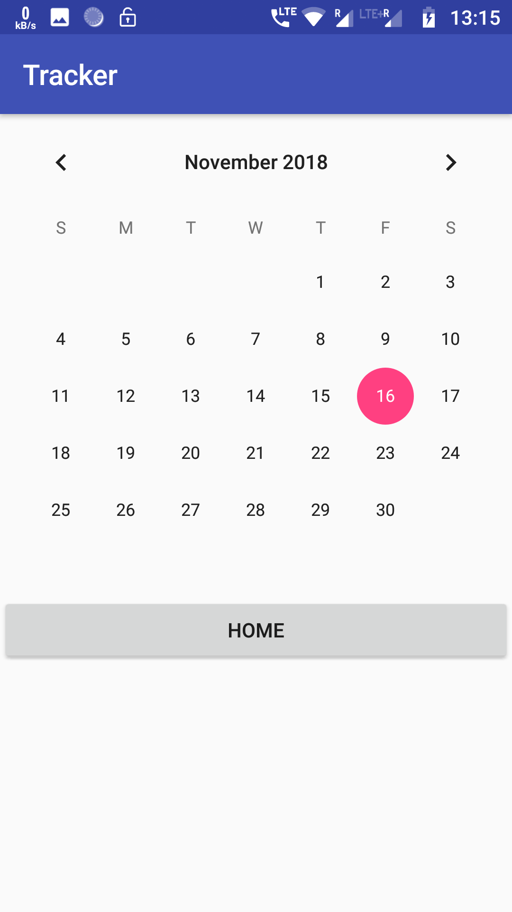

# Tracker
A Study Tracking Application

# Home Page
- On the home page user gets option to
  - Add/Change timer
  - Add/Change experience
  - Get Analysis
 

# Calander Page
- User can add/change experience of different days.

 

# Analysis Page
- Here user can see the analysis of previous months
 

# Time Page
- Here user can change the time to get daily notification

 
